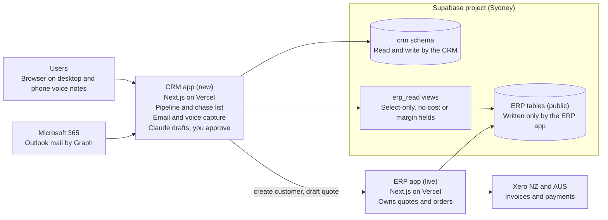

# saveBOARD CRM: System Design Brief v0.1

3 October 2026 · Paul Charteris

> Source of truth: the design brief doc in Claude. Edit the doc, then re-export to Markdown and replace this file so the repo copy does not go stale. Companion files: `docs/erp-reference/` (ERP schema and notes) and `supabase/migrations/` (the five CRM migrations).

## Purpose and scope

The CRM exists so that no enquiry goes quiet: it captures conversations automatically, tracks every opportunity from enquiry to ERP sales order, and tells you each morning who to chase. It replaces HubSpot, which today works as a contact database rather than a sales tool.

**Why replace HubSpot** (figures from HubSpot, 2 Oct 2026)

- 5,830 contacts and 4,055 companies, but only 42 deals, 2 emails and 0 meetings logged.
- 34 of the 42 deals have not been touched in over 7 days.
- No link to the ERP, no automatic email or call capture, and a pipeline that was never customised.

**In scope for phase 1:** contacts and companies, the pipeline from enquiry to order, Outlook email capture, post-call voice notes, the follow-up engine, a read-only ERP link with quote tracking, consultant visit import, and the HubSpot migration.

**Later phases:** website forms, email campaigns, social and ads.

**Not in the CRM:** quoting, pricing, stock, invoicing and payments. The ERP and Xero own these.

**Proposed success measures (to confirm):** within six months every open deal has activity in the last 7 days or a dated next step, email and call notes are logged without manual entry, and HubSpot is switched off.

## Decisions so far and users

These choices are settled and the design below builds on them.

| Area | Decision |
| --- | --- |
| Hosting | Same Supabase project as the ERP (Sydney), in a separate `crm` schema. New GitHub repo under the saveBOARD organisation and a new Vercel project. Built with Claude Code. |
| Email | Microsoft 365 / Outlook only, through the Microsoft Graph API. |
| Phone | Mobile only. Start with post-call voice notes. |
| Source of truth | The ERP, for trading accounts, products, prices, stock, quotes, orders and invoices. |
| Gone-quiet rule | 7 days with no activity on an open lead or deal. |
| Lead sources | Website form (2 to 3 enquiries a day) and about 160 specifier visits a month by contract consultants. |
| Consultants | They keep their own system. Their Excel log is uploaded to the CRM. |
| HubSpot workflows | None exist, so nothing to replicate. |
| Notes | A Claude skill writes the HubSpot notes today. It will be pointed at the CRM instead. |
| Pipeline | New enquiry, Contacted, Qualified, Quote sent, Negotiation, Won or Lost. Confirmed as a better fit than the HubSpot default. |

**Users:** 2 to 3, with Paul as the main user. Mark Stokes no longer works for us, so his 1,679 HubSpot contacts will be owned by Mark Atkinson. The third user is Iris, and Dave Elder may be a fourth in future. Consultants do not get CRM logins.

## Architecture and hosting

The CRM is a second app in the same GitHub, Vercel and Supabase accounts as the ERP. It shares the ERP's database project but never its tables.

Arrows show who calls whom. The CRM never writes to ERP tables.

The CRM app reads ERP data through select-only views and asks the ERP app to create customers and draft quotes.

- **GitHub:** a new repo under the saveBOARD organisation, built with Claude Code.
- **Vercel:** a new project, deployed to Sydney like the ERP.
- **Supabase:** the same project with a new `crm` schema. A separate project would add a sync layer between the two systems.
- **Background jobs:** Outlook sync, the daily chase list and voice-note processing run as scheduled jobs. The host for these is still to be chosen.

## ERP boundary and integration

The CRM reads the ERP through a small set of read-only views, and changes the ERP only through checked endpoints on the ERP app. The CRM never writes to ERP tables directly.

**Who owns what**

| Information | Owner | CRM behaviour |
| --- | --- | --- |
| Leads, prospects, deals, pipeline | CRM | Full control |
| People, roles, calls, emails, visits, notes | CRM | Full control. The ERP keeps only one primary contact per customer and one per delivery site. |
| Marketing lists and consent | CRM | Full control |
| Trading account: billing address, terms, price list, credit limit and hold | ERP | Read-only. Shown on the company page. |
| Delivery sites | ERP | Read-only |
| Quotes and sales orders: number, status, prices, stock | ERP | Linked by SO number, status and value mirrored |
| Invoices, payments, amount owing | ERP and Xero | Read-only: owing and overdue shown to the account manager |
| Sales history by customer and product | ERP | Totals and last order date shown |
| Company name and main address | Agreed master | Proposed: CRM owns it for prospects. Once linked to an ERP customer, the ERP owns the trading fields and the CRM keeps its own display name and contacts. |

**Reads: the `erp_read` views.** The CRM uses its own select-only database role limited to these views, never the app's owner credentials. The views live in a schema that Supabase does not expose through its Data API, because a plain view bypasses row-level security. They cover:

- `customers`, `customer_sites` and `entities` (NZ or AUS, currency, GST rate)
- `sales_orders` with the quote and invoice columns, and `order_lines`
- `sales_history`, `price_lists` and `price_list_items`
- `products` without `standard_cost`, plus a computed availability view (in stock, committed, expected) built from `stock_movements` without `unit_cost`

Two ERP rules shape the queries. A completed sale lives in both `sales_history` and `sales_orders`, so the CRM skips a `sales_orders` row when `sales_history` has the same entity and `so_number`. And an order counts as invoiced when `invoiced_on` is set, not by its status, because orders can be invoiced before shipping.

**Writes: ERP endpoints.** The ERP has no public API yet. Two small authenticated endpoints on the ERP app would cover the CRM's needs: create a customer (the ERP checks unique name per entity) and create a draft quote (priced from the customer's price list). Until they exist, Claude prepares the quote details and you enter them in the ERP. All data access goes through one CRM data layer, so the views can later be swapped for the ERP's planned read-only API without touching the rest of the CRM.

**Matching rules**

- Link a CRM company to an ERP customer by `customers.id` plus `entity_id`, never by name.
- A business trading in both countries is two ERP customers and one CRM company with two links.
- Exclude customers with `deleted_at` set. Treat `active = false` as a former customer.
- Quote prices come from the ERP price list. Credit hold blocks orders but not quotes, so the CRM shows a warning rather than blocking a deal.

**Never in the CRM:** the ERP `users` table (password hashes), `xero_connections` (tokens), `audit_log`, and every cost or margin field (`standard_cost`, MO costs, `stock_movements.unit_cost`). Any view or role change on the live database goes through Paul.

## CRM data model

The `crm` schema has 17 tables, centred on companies, contacts, deals and a single activity timeline. Every email, call note, visit and system event is an activity, which is what makes the 7-day rule simple to compute.

| Table | Purpose | Key fields |
| --- | --- | --- |
| `companies` | Organisations, prospects and customers | name, domain, country (NZ or AUS, normalised), segment, owner, `hubspot_id`. ERP customers are linked through `company_erp_links`, one row per entity |
| `contacts` | People, many per company | name, email, phone, role, company, `samples_sent`, source, owner, consent status, `last_activity_at`, `hubspot_id` |
| `deals` | Opportunities, one pipeline | company, main contact, entity (NZ or AUS), stage, source, owner, estimated value and currency, `erp_so_number`, mirrored ERP quote status and value, next action date, lost reason |
| `activities` | One timeline for everything | type (email, call note, meeting, note, visit, system), direction, subject, Claude summary, occurred at, contact, company, deal, origin, external id for de-duplication |
| `tasks` | Next actions and chases | due date, linked deal or contact, status, created by (person or Claude), draft text |
| `visits` | Consultant specifier visits | consultant, visit date, specifier, company, notes, import batch |
| `import_batches` | Audit of every Excel or HubSpot load | file, rows read, created, updated, skipped, run time |
| `voice_notes` | Post-call recordings | audio path, transcript, status, resulting activity |
| `mail_sync_state` | Outlook sync position per user | Graph delta token, last run, errors |
| `audit_log` | Who or what changed what | actor (including Claude), table, record, before and after |

**Mapping from HubSpot:** the two custom properties become fields. *Company Style* becomes `segment` (Architect/Designer, Builder, Merchant, Other Stakeholders) and *Samples Sent* becomes `samples_sent`.

**Design rules**

- Every deal carries an entity, so it lines up with the ERP's NZ and AUS companies and currencies.
- Money is stored in the deal's own currency, never converted silently.
- Original HubSpot IDs are kept so any migrated record can be traced back.
- Row-level security is on for every table. The CRM app reaches the data through a dedicated database role, in the same way the ERP does.

## Pipeline and automatic deal movement

The pipeline has six working stages plus Lost, and the middle and end stages move on their own from Outlook activity and ERP quote status, so you only move deals by hand when judgement is needed.

| Stage | How a deal gets here | Automatic trigger |
| --- | --- | --- |
| New enquiry | Website form, direct email, or saveBOARD outreach | A new form submission or unmatched inbound email creates the deal |
| Contacted | First reply or call with the prospect | An outbound email in Sent Items or a logged call note |
| Qualified | Need, entity and products are understood | Claude suggests it from the conversation. You confirm. A draft ERP quote keeps the deal here. |
| Quote sent | Quote issued to the customer | ERP quote status becomes `sent`. The 7-day chase clock starts. |
| Negotiation | Customer replies with questions or changes | Claude suggests it when a reply arrives after the quote is sent. You confirm. |
| Won | Customer accepts | ERP quote status becomes `accepted` and the order is open |
| Lost | Customer declines or goes silent | ERP quote status becomes `declined` or `expired`, or you close it with a reason |

When an order is later shipped, invoiced and paid in Xero, the company page shows it. The deal itself stays Won.

**Specifier track (draft).** Consultant visits to specifiers are a different relationship from a buyer's enquiry, so they follow a lighter track at contact level: Visited, Follow-up, Specified, Enquiry. A specifier becomes a deal only when a real enquiry arrives. Please confirm this split.

**Existing customers** are not a pipeline stage. They are companies linked to an ERP customer, and the CRM uses ERP sales history to show last order date and flag customers who have stopped ordering. With existing customers we should have a 2-monthly follow-up as they are potential recurring clients. Most may only be one-off projects, however customers like Fulton Hogan buy on a regular basis and we should have a regular follow-up to see what new is coming.

## Follow-up engine

Every morning the CRM builds one ranked chase list from a handful of rules, and Claude drafts the message for each item. Nothing is ever sent automatically: drafts land in your Outlook Drafts folder for approval.

| Rule | Trigger | What happens |
| --- | --- | --- |
| Gone quiet | Open deal or active lead with no activity for 7 days | Added to the chase list with a drafted follow-up |
| Quote unanswered | ERP quote status `sent` for 7 days with no reply in Outlook | Draft chase referencing the quote number |
| Quote expiring | ERP `quote_expires_on` within 3 days (proposed) | Reminder to extend or close it |
| Slow first response | New enquiry not contacted within 1 business day (proposed) | Alert at the top of the list |
| Specifier follow-up | Consultant visit with no follow-up in 7 days | Task and drafted note to the specifier |
| Existing customer check-in | 2 months since the last activity on a customer linked to the ERP | Check-in task and drafted note asking what is coming up. Regular buyers such as Fulton Hogan stay on this cycle. Kept separate from leads. |
| Overdue invoice | ERP `xero_amount_due > 0` and `invoice_due_on` in the past | Shown on the company page. Not a sales chase. |

**The clock:** any activity resets the 7 days, including an inbound reply captured from Outlook, a voice note or a manual note. A snooze with a reason pauses a deal, so the list stays trusted and does not fill with noise.

**Start with the right records.** Only 664 of 5,830 HubSpot contacts have any activity date, and 12 of those are from the last 7 days. Running the rules over all contacts would flag thousands of dormant leads on day one. The engine therefore runs on deals and on contacts you mark as active, and the dormant database is worked in batches later.

**The daily digest** is one email or Teams message at a set time (such as 7:30 am) listing: chases due today, new enquiries, quotes awaiting a reply, and expiring quotes. The same list is the CRM home screen.

## Email and phone capture

Email is captured automatically from Outlook, and calls are captured by a 30 to 60 second voice note after each call. Both end up as activities on the right contact and deal.

**Email (Microsoft Graph)**

1. Each user signs in with Microsoft once and consents to read their own mailbox.
2. The CRM watches Inbox and Sent Items for changes using Graph delta queries.
3. Each message is matched to a contact by sender or recipient address. Internal saveBOARD addresses are ignored.
4. Claude writes a short summary, the next step and any follow-up date, then logs it as an activity. This is the existing notes skill, pointed at the CRM.
5. An inbound reply resets the 7-day clock. Unknown external addresses go to an "unmatched" queue for you to accept or ignore, so junk senders never create records on their own.
6. Chase drafts are created in Outlook Drafts. The CRM does not request permission to send mail, so it cannot send on your behalf.

Proposed to limit the privacy footprint: store the summary, subject, date and a link to the message, not the full email body.

**Phone (post-call voice note)**

1. After a call, open the CRM on your phone and tap record. Or dictate with Wispr Flow and send the text to the CRM.
2. Audio goes to Supabase Storage and is transcribed.
3. Claude extracts who, what was agreed, the next step and a follow-up date.
4. A confirm screen shows the matched contact and deal. You tap to accept, which creates the activity and task.

This needs no call recording and avoids recording consent issues. Full call recording through native phone features or a Teams Phone number can feed the same pipeline later. If you do record calls, tell the other party at the start: Australian states mostly need every party's consent, and New Zealand expects disclosure under the Privacy Act. Check the details with your adviser.

**Website enquiries:** the website form should post directly to the CRM, creating the contact and a New enquiry deal and assigning an owner. How the form submits today is an open item.

## Consultant visit import

Consultants keep their own system, so the CRM takes their Excel log through a repeatable upload that turns about 160 visits a month into specifiers, visit records and follow-up tasks.

1. Upload the Excel file on an import screen.
2. Map columns to CRM fields. The mapping is saved, so later uploads are one click.
3. Validate each row and show problems before anything is saved.
4. Match each row to an existing contact (by email, otherwise by name and company) and create the contact and company if none exists.
5. Create a visit record and a follow-up task due 7 days after the visit date.
6. Show an import report: rows read, created, updated and skipped.

**Re-uploading is safe.** Each row gets a fingerprint, so uploading the same file twice, or a file that overlaps last month's, creates no duplicates.

**Fix the lag.** A monthly upload leaves visits up to 30 days old before anyone follows up, and the task due date would already be overdue. Ask consultants to send the log weekly, or have their system export on a schedule. The import works the same either way.

To build the column mapping, a sample of the consultants' Excel log is needed.

## HubSpot migration

The data is small and mostly clean enough to move in one pass, but 98% of contacts are bulk imports, so the work is cleaning and matching rather than copying.

**What moves** (HubSpot, 2 Oct 2026)

| Object | Records | Handling |
| --- | --- | --- |
| Contacts | 5,830 | Loaded to `contacts` with HubSpot ID kept |
| Companies | 4,055 | Loaded to `companies`. Some have a domain but no name. |
| Deals | 42 | Re-staged into the new pipeline. 32 are in the first HubSpot stage and 5 have no stage, so each needs a manual look. |
| Notes | 976 | Loaded as activities |
| Tasks | 132 | Open tasks loaded, completed ones kept as history |
| Calls | 66 | Loaded as call-note activities |
| Emails | 2 | Loaded as activities |

**Data quality findings from the contacts export**

| Finding | Count | Handling |
| --- | --- | --- |
| Duplicate email addresses | 0 | None needed |
| No name | about 997 (17%) | Keep. Flag for review. |
| Generic mailbox (info@, admin@ and similar) | about 714 | Mark as generic and attach to the company, not a person |
| Country field contains suburbs or states | Several hundred | Normalise to NZ or AUS. This also sets the likely ERP entity. |
| No phone | 63% | Keep. Standardise formats where present. |
| No owner | 510 | Assign a default owner. Mark Stokes' 1,679 contacts go to Mark Atkinson. |
| No company | 240 | Match by email domain, otherwise leave unlinked |
| Company Style blank | 2,081 | Leave blank, fill later from visits |
| Any last-activity date | 664 (11%) | Used as the starting activity date |

**Steps**

1. Export every HubSpot object with its associations. Companies, deals, notes, tasks and calls still need exporting, and so do unsubscribes and bounces.
2. Load into staging tables and clean: normalise country, phone and names.
3. Match companies to ERP customers per entity using name, domain and email. Review the uncertain matches in a queue.
4. Load into the `crm` schema with HubSpot IDs retained.
5. Run HubSpot and the CRM in parallel for about two weeks.
6. Switch HubSpot to read-only, then cancel.

**Marketing consent must come across.** HubSpot's unsubscribe and bounce lists are not in the contacts export. They must be migrated so nobody who opted out is emailed again.

## Claude as the AI layer

Claude works the whole path from enquiry to sales order, but it drafts and you approve: it never sends mail, issues a quote or creates a customer without your confirmation.

| Step | What Claude does | Where it writes |
| --- | --- | --- |
| Capture | Summarises emails and voice notes, extracts next steps and follow-up dates | `activities`, `tasks` |
| Qualify | Reads a new enquiry, suggests entity (NZ or AUS), segment, products of interest and a stage | `deals`, `contacts` |
| Chase | Drafts each follow-up on the daily list in your voice | Outlook Drafts |
| Quote | Proposes quote lines from the conversation, prices them from the customer's price list, checks availability from the ERP stock ledger, then creates a draft quote through the ERP endpoint | ERP draft quote, linked to the deal |
| Order | When the customer accepts, you convert in the ERP and the deal moves to Won automatically | Deal stage |
| Ask | Answers questions such as "which specifiers have I not followed up in 30 days?" | Read-only |

**Guardrails**

- Claude reaches the data through the same limited roles as the app, so it can never see cost or margin.
- Every write by Claude is recorded in the audit log with Claude as the actor.
- Claude can raise a credit-hold or out-of-stock warning on a quote, but cannot override either.

**How Claude connects (to decide).** The CRM can offer its own tool server so that Claude in chat, Claude Code or Cowork can read and update CRM records directly. The alternative is for Claude to run only inside the CRM app's background jobs. The tool server gives you more flexibility but needs careful permissions.

## Security, privacy and consent

The main security risk is the CRM exposing ERP data it should not see, so the design limits access at the database before anything else.

- **Isolation:** the `crm` and `erp_read` schemas are not exposed through Supabase's public Data API. Row-level security is on for every table, and the CRM app uses its own database role.
- **ERP access is read-only and column-limited:** no password hashes, Xero tokens, audit data or cost fields.
- **Sign-in:** Microsoft 365 sign-in for the 2 to 3 users. This is separate from the ERP's own username and password accounts. It is needed anyway for Outlook access.
- **Least privilege on mail:** the CRM asks to read mail and create drafts, but not to send. Tokens are stored encrypted.
- **Audit:** every change records who or what made it, including Claude.
- **Backups:** confirm the Supabase plan's backup and point-in-time recovery settings, because the CRM will share the ERP's project.

**Privacy.** Captured email and voice notes are personal information under the New Zealand Privacy Act 2020 and the Australian Privacy Act. Keep only what is needed (summaries rather than full bodies), and set a retention period.

**Marketing consent.** Bulk email in Australia and New Zealand needs consent and a working unsubscribe, under the Spam Act 2003 and the Unsolicited Electronic Messages Act 2007. Each contact therefore carries a consent status and source, and unsubscribes are honoured automatically. This applies from phase 2, when email campaigns arrive. I am not a lawyer, so check requirements with your adviser.

## Marketing (phase 2 and later)

Marketing waits until the sales pipeline works, because HubSpot is only used for occasional email campaigns today and the pipeline is the bigger gap.

- **Website forms:** the enquiry form posts straight to the CRM. This is pulled into phase 1 because it feeds the pipeline.
- **Email campaigns:** send lists built from CRM segments (segment, country, samples sent) through a bulk-email provider, with unsubscribe handling and consent status enforced. The provider is not yet chosen.
- **Social:** a content calendar and post drafts by Claude, with approval before anything is published.
- **Ads:** reporting first, to link ad spend to enquiries. Managing ads comes last.

Campaigns are the only HubSpot feature you use that the first phases do not replace, so marketing can follow the cutover without delaying it.

## Build phases

The order puts the biggest pain first: email capture and the chase list come before the nice-to-haves. Dates are not set yet.

1. **Foundation:** new GitHub repo and Vercel project, the `crm` schema, Microsoft sign-in, and the `erp_read` views and role (Paul approves the live database change).
2. **Migration and core screens:** HubSpot data cleaned and loaded, companies matched to ERP customers, company and contact pages with a read-only ERP panel, and the deals board with the new pipeline.
3. **Capture and chase:** Outlook sync, the follow-up engine, the daily digest and Claude-drafted chases. Website form posts to the CRM.
4. **Voice notes and consultant import:** the post-call voice note flow and the Excel visit import.
5. **ERP quote link and write-back:** deal stages follow ERP quote status automatically, then the ERP endpoints for creating customers and draft quotes.
6. **Cutover:** about two weeks in parallel with HubSpot, then switch it off.
7. **Phase 2:** email campaigns, social and ads.

## Open items and decisions needed

Ten items remain before the build can start, and the first four block the most work.

| # | Item | Why it matters |
| --- | --- | --- |
| 1 | Approve the `erp_read` schema, views and select-only role on the live database | Needed for all ERP links. Any live change goes through Paul. |
| 2 | Confirm the ERP write path: add two small endpoints to the ERP app, or enter quotes by hand at first | Decides whether Claude can create draft quotes and customers |
| 3 | Supply a sample of the consultants' Excel log, and the number of consultants | Needed to build the import mapping |
| 4 | Say how the website form submits today (HubSpot embed, email, or other) | Needed to route enquiries into the CRM |
| 5 | Export from HubSpot: companies, deals, notes, tasks, calls, unsubscribes and bounces | Migration and consent |
| 6 | Confirm the users (Paul, Mark Atkinson, Iris, and possibly Dave Elder later) and who owns the 510 contacts with no owner | Roles, sign-in and default ownership |
| 7 | Confirm the stages and the specifier track | Pipeline configuration |
| 8 | Choose the transcription route for voice notes, and phone app or Wispr Flow | Voice capture build |
| 9 | Decide whether to store email summaries only or full bodies, and the retention period | Privacy design |
| 10 | Set the timings: chase after 7 days, quote expiry reminder at 3 days, first-response target of 1 business day, and customer check-ins every 2 months | Follow-up engine rules |

**Also to confirm:** the Supabase backup and point-in-time recovery settings for the shared project, and the company-master rule in the ERP boundary section.
